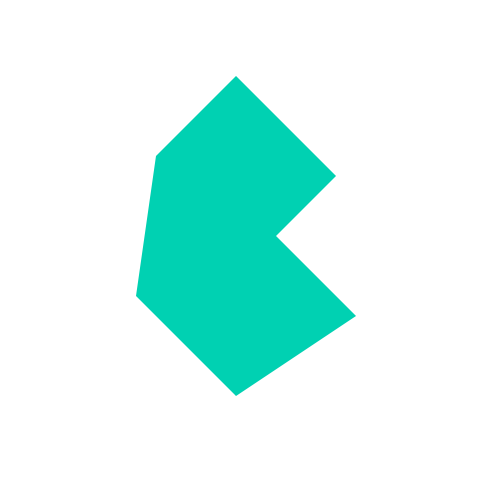

# Gustavo Adolfo Cogollo   

    

Hola soy un Full Stack Developer amante del desarrollo, fanatico del futbol y los videojuegos enamorado de mi familia y de linux, puedes conocer un poco mas de mi trabajo pasando por mis repositorios o si prefieres puede contactarme por mi perfil de Linkedin o por Telegram:  

    <table>
        <tr>
            <td>
                <table>
                    <thead>
                        <tr>
                            <th>Lenguajes y Tecnologias</th>
                            <th>Front-end</th>
                        </tr>
                    </thead>
                    <tbody>
                        <tr>
                            <td>HTML 5</td>
                            <td></td>
                        </tr>
                        <tr>
                            <td>CSS3</td>
                            <td></td>
                        </tr>
                        <tr>
                            <td>Javascript</td>
                            <td></td>
                        </tr>
                        <tr>
                            <td>Boostrap</td>
                            <td></td>
                        </tr>
                        <tr>
                            <td>Bulma</td>
                            <td></td>
                        </tr>
                        <tr>
                            <td>Tailwind</td>
                            <td></td>
                        </tr>
                        <tr>
                            <td>Sass</td>
                            <td></td>
                        </tr>
                        <tr>
                            <td>VueJs</td>
                            <td></td>
                        </tr>
                        <tr>
                            <td>WordPress</td>
                            <td></td>
                        </tr>
                    </tbody>
                </table>
            </td>
            <td>
                <table>
                    <thead>
                        <tr>
                            <th>Lenguajes y Tecnologias</th>
                            <th>Backend</th>
                        </tr>
                    </thead>
                    <tbody>
                        <tr>
                            <td>PHP</td>
                            <td></td>
                        </tr>
                        <tr>
                            <td>Python</td>
                            <td></td>
                        </tr>
                        <tr>
                            <td>Laravel</td>
                            <td></td>
                        </tr>
                        <tr>
                            <td>Django</td>
                            <td></td>
                        </tr>
                        <tr>
                            <td>Django REST Framework</td>
                            <td></td>
                        </tr>
                        <tr>
                            <td>Firebase</td>
                            <td></td>
                        </tr>
                        <tr>
                            <td>NodeJs</td>
                            <td></td>
                        </tr>
                        <tr>
                            <td>SQlite</td>
                            <td></td>
                        </tr>
                        <tr>
                            <td>MariaDB</td>
                            <td></td>
                        </tr>
                        <tr>
                            <td>Myqsl</td>
                            <td></td>
                        </tr>
                    </tbody>
                </table>
            </td>
        </tr>
    </table>

<table>
    <thead>
        <tr>
            <th>Otras Tecnologias y Herramientas</th>
            <th></th>
        </tr>
    </thead>
    <tbody>
        <tr>
            <td>Linux</td>
            <td></td>
        </tr>
        <tr>
            <td>Git</td>
            <td></td>
        </tr>
        <tr>
            <td>Figma</td>
            <td></td>
        </tr>
        <tr>
            <td>Elementor</td>
            <td></td>
        </tr>
        <tr>
            <td>Inkscape</td>
            <td></td>
        </tr>
        <tr>
            <td>Gimp</td>
            <td></td>
        </tr>
        <tr>
            <td>Godot</td>
            <td></td>
        </tr>
        <tr>
            <td>Unity 3D</td>
            <td></td>
        </tr>
    </tbody>
</table>

---

